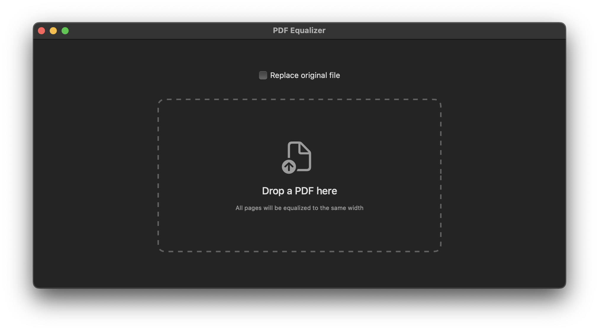

# PDF Equalizer

A lightweight macOS app that equalizes all pages of a PDF to the same width. Pages are adjusted losslessly by modifying the page media box — no re-rendering or quality loss. Useful when scanned documents or merged PDFs have inconsistent page sizes.



## Features

- **Drag & drop** a PDF onto the window or the Dock icon
- **Equalizes all pages** to match the widest page in the document
- **Replace original file** option to overwrite the source PDF directly
- Outputs a new file with `_equalized` suffix by default

## Download

Download the latest universal binary (Apple Silicon + Intel) from the [Releases](../../releases) page.

### Opening the app (unsigned)

Since the app is not signed with an Apple Developer certificate, macOS will block it on first launch. To open it:

1. **Right-click** (or Control-click) on `PDF Equalizer.app`
2. Select **Open** from the context menu
3. Click **Open** in the dialog that appears

You only need to do this once. After that, the app will open normally.

Alternatively, you can remove the quarantine attribute via Terminal:

```bash
xattr -d com.apple.quarantine "PDF Equalizer.app"
```

## Build from source

Requires **Xcode Command Line Tools** on macOS 12.0 or later.

```bash
# Debug build (current architecture)
./build.sh

# Universal binary (Apple Silicon + Intel)
./build-universal.sh
```

The built app will be in `build/` or `build-universal/universal/`.

## License

MIT
